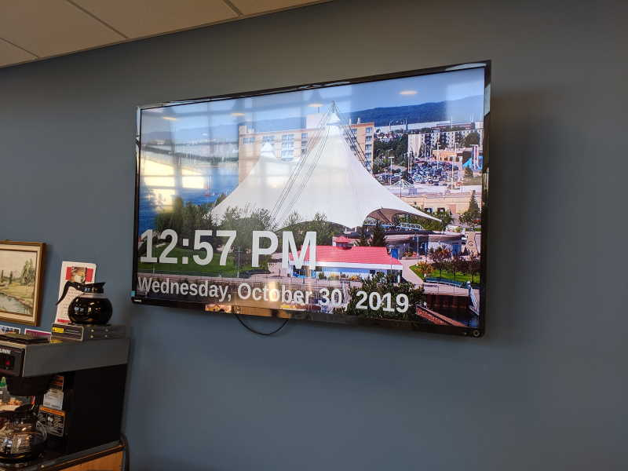

# City Facility TV Display Documentation

This repository contains tips, tricks, and setup instructions
for [cityssm/tv-display](https://github.com/cityssm/tv-display) based
TV Displays.

## The Main Setup

Setups can greatly vary depending on your environment, with the basic steps as
follows.

1.  **Clone or download the
    [cityssm/tv-display repository](https://github.com/cityssm/tv-display) to a
    web server.**

    The web server can run on the machine that will be displaying the content,
    or on another machine that will be visible to the display machine over
    a network connection.

2.  **Build a `config.json` file, defining the content that will be shown.**

3.  **Open a web browser on the display machine and point it at the display
    configuration.**

    To load the `default.json` configuration, for example, the link might be:
    <http://localhost/tv-display/?config=default>

## Device Setups

Although these instructions are geared towards specific operating systems,
it should be possible to use them on the OS of your choice.

-   [Setup on Linux Mint](deviceSetup/linuxMint.md) - Includes instructions for
    a local web server.
-   [Setup on a Raspberry Pi](deviceSetup/raspberryPi.md) - Includes instructions
    for a local web server.

## "Real World Sault Ste. Marie" Setups

### Installed

-   Civic Centre - Clerk's Department
-   Civic Centre - Lobby
-   Transit - Dennis Street Bus Terminal
-   Transit - Staff Room
-   John Rhodes Community Centre - [Case Study](realWorld/johnRhodes.md)
-   Northern Community Centre - Seniors 55+
-   Seniors' Drop-In Centre

### In the Works

-   Northern Community Centre

## Tips and Tricks

-   [Tips](tipsAndTricks/tips.md)
-   [Troubleshooting](tipsAndTricks/troubleshooting.md)
