# How to Setup a TV Display using Linux Mint Cinnamon

The instructions below describe the process of setting up a
[Linux Mint](https://www.linuxmint.com/) machine to run the TV Display.
Linux Mint is by no means the required distribution for running the TV Display
application.  Depending on the computer you intend to use to run the display,
Linux Mint may be too heavy. It's just a really friendly, easy to use
distribution for anyone who might be intimidated by setting this up on Linux.
**Any distribution should work.**

The instructions below include details for two types of installations,
depending on where the TV Display application is hosted.

-   If the display machine will have good network connectivity,
    the TV Display application can be hosted from a web server running on a
    different computer. This is best if multiple displays will be used as the
    configuration can be centralized.

-   If network connectivity will be an issue, or if only one display is needed,
    the TV Display application can run on the same machine that is used to
    display the content. There are additional steps to run a _local installation_,
    but it's still pretty easy.

## Prerequisites

-   A computer running Linux Mint Cinnamon edition.
    (See the [Linux Mint Installation Guide](https://linuxmint-installation-guide.readthedocs.io/en/latest/)
    for assistance.)

-   A network connection for the setup process.
    Once set up, the machine should be able to run offline if the local
    installation steps are followed.

### Setup Recommendations

Although not required, some of the following settings offered during the
installation process may help later.

-   If you can have a network connection during the setup process,
    it may reduce the number of updates to process later.

-   When asked, select "Install third-party software for graphics and Wi-Fi
    hardware, Flash, MP3 and other media".

-   If the computer will have no other purpose, select "Erase disk and install
    Linux Mint".

-   When given the option, select "Log in automatically".

## Update the Computer

To ensure things run smoothly, it's best to update all of the software on the
computer to it's latest versions. Linux Mint handles its update using an
application called **Update Manager**.

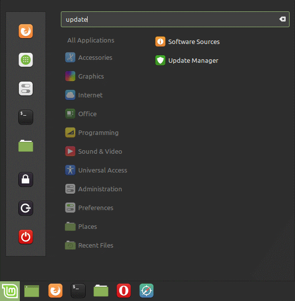

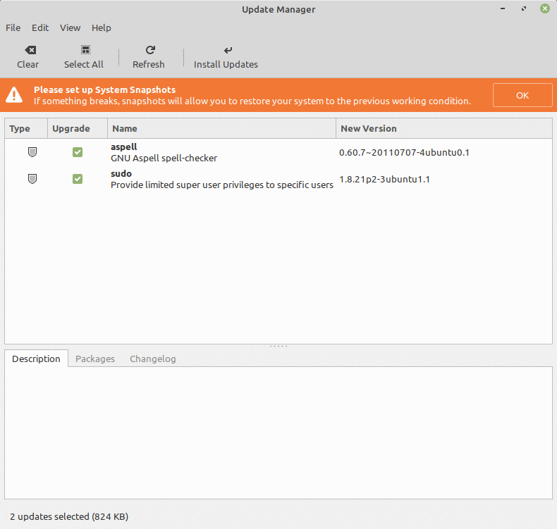

Install all available updates.

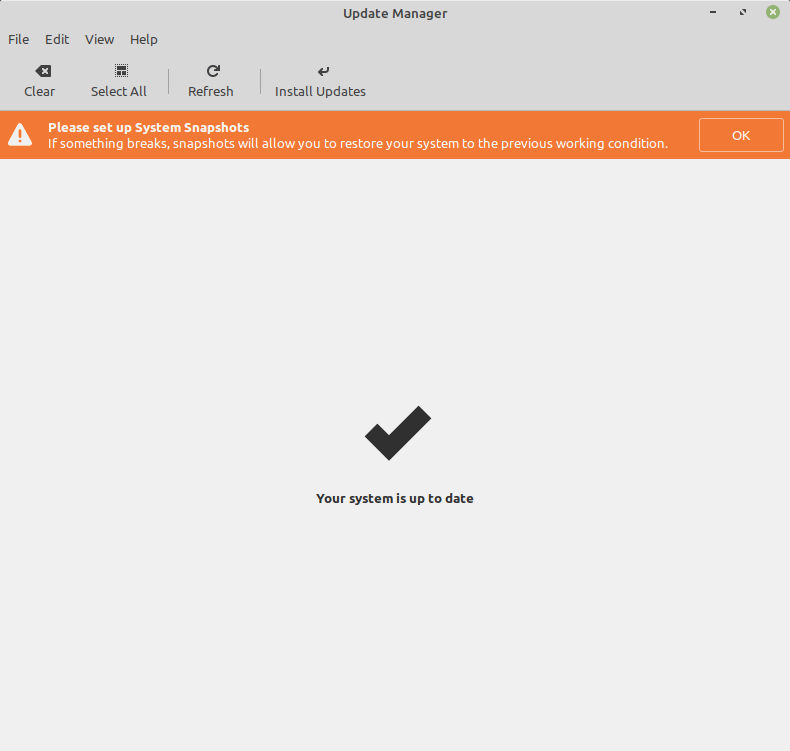

## Disable the Screensaver

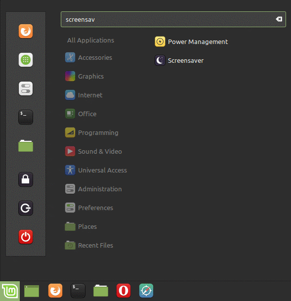

Select "Screensaver".

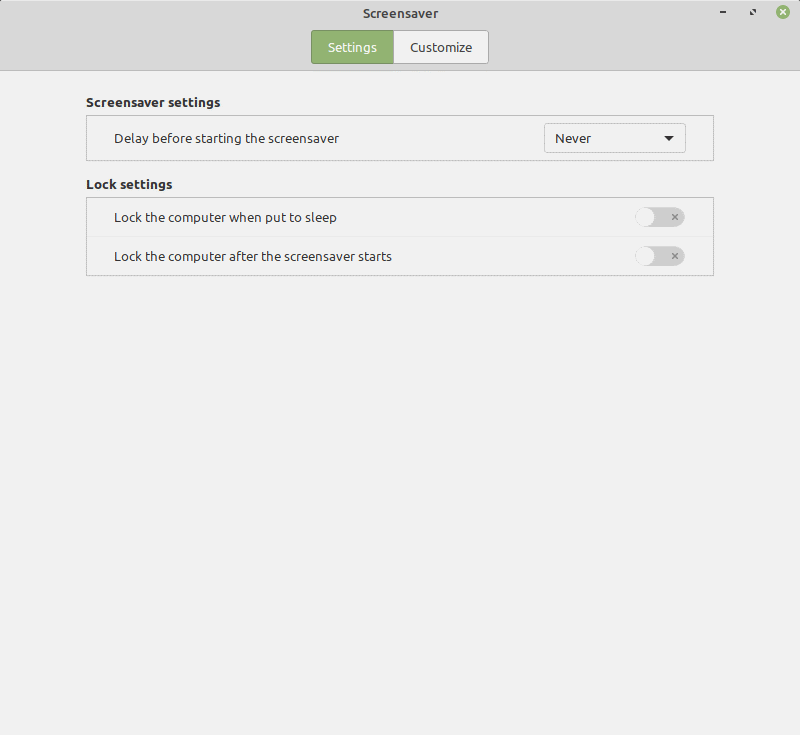

-   Set "Delay before starting the screensaver" to **Never**.
-   Turn off "Lock the computer when put to sleep".
-   Turn off "Lock the computer after the screensaver starts".

## Adjust the Power Saving Options

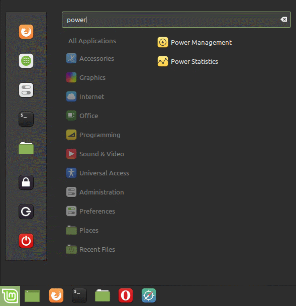

Select "Power Management".

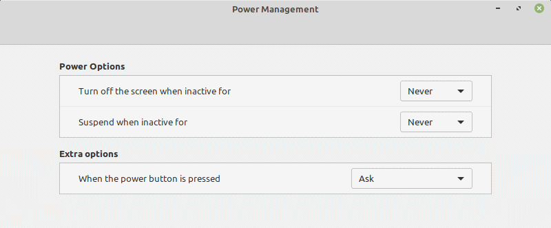

-   Set "Turn off the screen when inactive for" to **Never**.
-   Set "Suspend when inactive for" to **Never**.

## Set Up Auto Logon

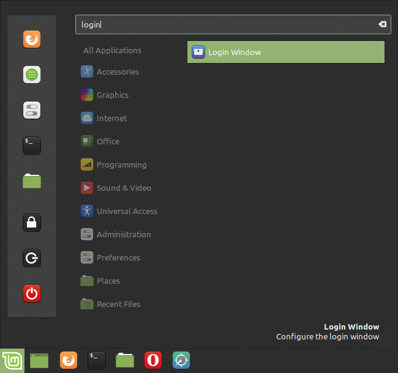

Select "Login Window".

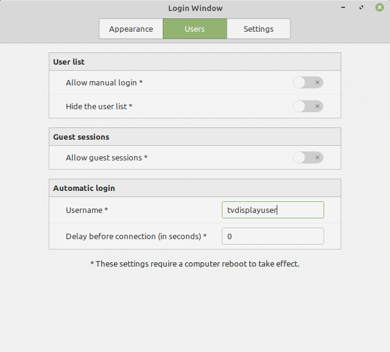

-   Navigate to the "Users" tab.
-   Under "Automatic login", set the "Username" field to the main user on the
    machine.

## Install Additional Software

The additional applications required for this installation can be found in the
**Software Manager** application.

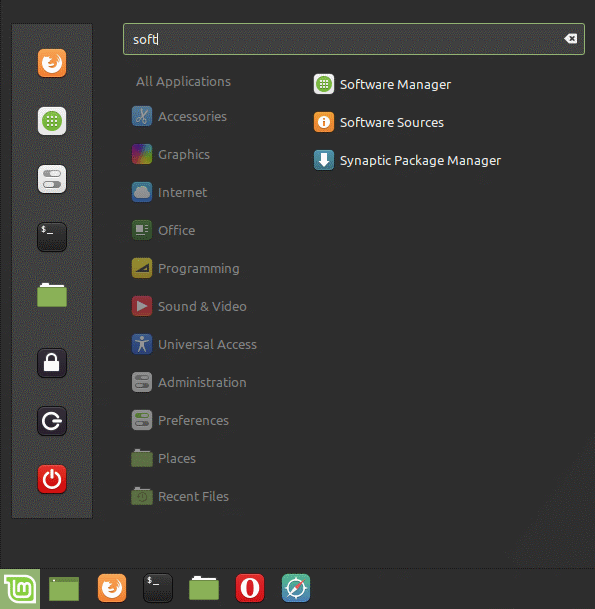

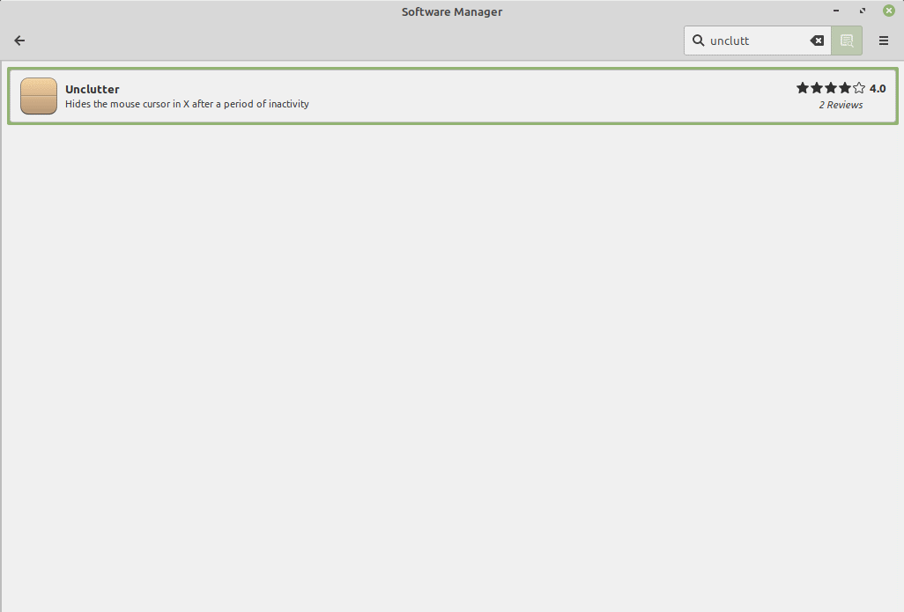

Search for each of the following applications.  Click on them to see their
details.  Click "Install" to install them.

### All Installations

-   **Unclutter** (hides the mouse cursor when the mouse isn't moving)

The display needs a web browser to display the application.  You only need one.

-   **Firefox** (web browser)

**OR**

-   **Chromium-browser** (web browser)

-   **Chromium-codecs-ffmpeg** or **Chromium-codecs-ffmpeg-extra**
    (for increased video support)

### Local Installations Only

-   **Geany** (for easier JSON editing)

-   **Git** (for downloading and updating the TV Display application)

-   **Nginx-light** (a web server for hosting the TV Display application)

-   **Openjdk-11-jre** (runs the FilesJsonGenerator.jar application,
    Openjdk-8-jre or better should be fine)

## Install and Configure the TV Display Application (Local Installations Only)

_If you're installing the TV Display application on another server,
documentation is coming, but will be very similar to the steps described below._

The next steps will run in the Terminal.

_Important Note: Only type the command as it appears after the $ symbol._

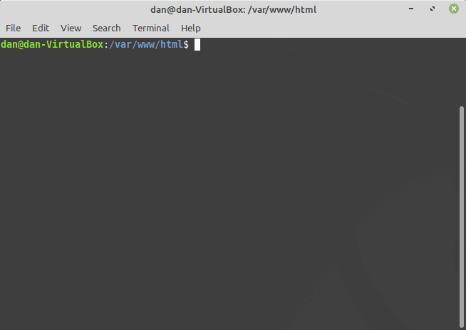

The default folder location for nginx on Linux Mint is `/var/www/html`.
Go to that directory.

```bash
cd /var/www/html
```

Clone the tv-display repository.

```bash
sudo git clone https://github.com/cityssm/tv-display.git
```

If successful, you should now be able to view the welcome configuration by
visiting <http://localhost/tv-display>

If required, clone the
[tv-display-ssm-public repository](https://github.com/cityssm/tv-display-ssm-public)
as well. It contains additional content specific to City of Sault Ste. Marie
TV displays, like a transit departure clock and a social media advertisement.

```bash
sudo git clone https://github.com/cityssm/tv-display-ssm-public.git
```

Make a directory for the display's custom content.

```bash
sudo mkdir tv-assets
sudo chmod 777 tv-assets
```

For help getting started, copy over `template-offline.json` from the
`tv-display/config` directory. This template makes it easy to run through three
groups of images (imageList content) while displaying a clock in between.

```bash
cd tv-assets
cp ../tv-display/config/template-offline.json config.json
```

For easier refreshing of the imageList `files.json` files, download the
`FilesJsonGenerator.jar` from the [cityssm/tv-display-filesJSON repository](https://github.com/cityssm/tv-display-filesJSON).

```bash
wget https://github.com/cityssm/tv-display-filesJSON/raw/master/dist/FilesJsonGenerator.jar
wget https://github.com/cityssm/tv-display-filesJSON/raw/master/dist/generateFilesJSON.sh
```

## Setup the Startup Applications

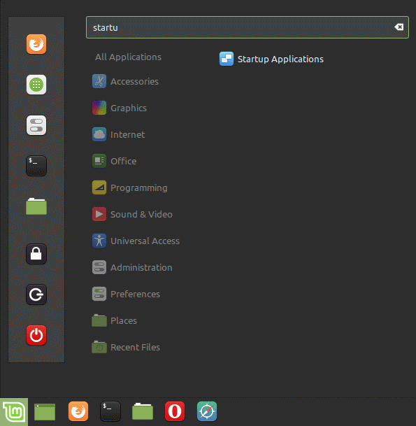

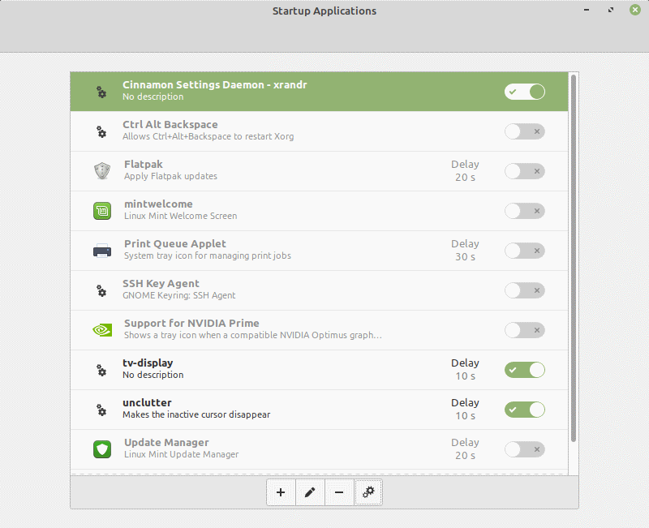

Most of the startup applications can be safely disabled to free up resources
and reduce the chance of a notification appearing on the display.
If "Cinnamon Settings Daemon - xrandr" is in the list, keep it enabled
as it makes some of the display settings work smoother.

First we'll add the application to make the mouse cursor disappear when its
inactive. Click the **+** button to add a **Custom Command**.

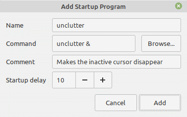

-   Set the "Name" to **unclutter**.
-   Set the "Command" to `unclutter &`
-   Set the "Startup delay" to **10 seconds**.
-   Click Add.

Next, add a startup application for _one_ web browser.

### Firefox Web Browser

Click the **+** button to add a **Custom Command**.

-   Set the "Name" to **tv-display**.
-   Set the "Command" to the following, all on one line.
    (It's only separated to make reading all of those switches easier.)

```console
firefox -kiosk http://localhost/tv-display/?config=/tv-assets/config
```

_Note that if your TV Display application is running on another machine,
the website address should be changed accordingly._

-   Set the "Startup delay" to **10 seconds**.
-   Click Add.

You can test the success of the above command by highlighting the "tv-display"
entry, and clicking the Run Now "gears" button.

### Chromium Web Browser

Click the **+** button to add a **Custom Command**.

-   Set the "Name" to **tv-display**.
-   Set the "Command" to the following, all on one line.
    (It's only separated to make reading all of those switches easier.)

```console
chromium-browser http://localhost/tv-display/?config=/tv-assets/config
  --start-fullscreen --kiosk --incognito --noerrdialogs --disable-translate
  --no-first-run --fast --fast-start --disable-infobars
  --password-store=basic
```

_Note that if your TV Display application is running on another machine,
the website address should be changed accordingly._

-   Set the "Startup delay" to **10 seconds**.
-   Click Add.

You can test the success of the above command by highlighting the "tv-display"
entry, and clicking the Run Now "gears" button.

## Restart the Computer

On restart, the computer should load up the display with the configuration you
copied over. Use <kbd>Alt</kbd> <kbd>F4</kbd> to leave the full screen web browser.

Now it's time to start customizing your content with the `config.json` file.
(Documentation is the works.)

## Appendix - Updating the TV Display Application (Local Installations Only)

Is there a new feature or bug fix you need for the TV Display application?

Connect the machine to the Internet and open a Terminal.
The following command will download the latest code from GitHub.

```bash
cd /var/www/html/tv-display
sudo git pull origin master
```

While you're connected to a network, visit the **Update Manager** application
as well to get the latest updates for your machine in general.
