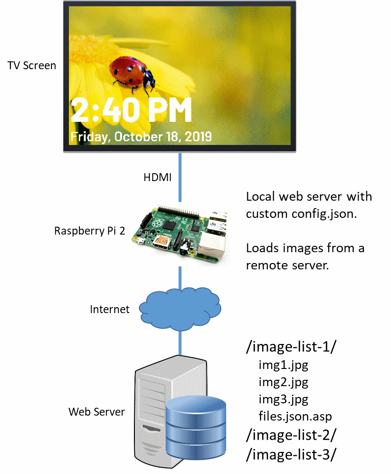

# Real World Installation - John Rhodes Community Centre



The John Rhodes Community Centre setup uses the following components.

**TV Screen**

- A standard 1080p television screen with an HDMI output connected to a Raspberry Pi.

**Raspberry Pi**

- A Raspberry Pi 2 Model B running Raspbian Buster.
- Set up using [Raspberry Pi Device Setup](../deviceSetup/raspberryPi.md) documentation
- Includes local web server installation.
- Connected to the Internet over WiFi.

**Web Server**

- Hosts folders of images.
- Each folder contains a `files.json.asp` file which lists the image folder contents (*.jpg and *.png) on the fly.


## What Does the `config.json` Look Like?

```json
{
  "displayDefaults": {
    "fontFamily": "Barlow, sans-serif"
  },
  "contentDefaults": {
    "clock": {
      "displaySeconds": 45,
      "backgroundImage": "../tv-assets/clockBackground.png",
      "includeSeconds": false
    },
    "imageList": {
      "displaySeconds": 3600,
      "imageSeconds": 20
    }
  },
  "contentList": [{
      "contentType": "clock"
    },
    {
      "contentType": "imageList",
      "backgroundImages": "http://remoteWebServer/image-list-rhodes/files.json.asp"
    },
    {
      "contentType": "clock"
    },
    {
      "contentType": "imageList",
      "backgroundImages": "http://remoteWebServer/image-list-community-centres/files.json.asp"
    }
  ]
}

```

The above configuration alternates between displaying a clock and displaying an image list.
Two different image lists are used.
- `image-list-rhodes` is for content specific to the location, and shown exclusively at the John Rhodes Community Centre.
- `image-list-community-centres` is for content that is shown at multiple community centres.

Each image list relies on a `files.json.asp` file, which list the names of the image files in the directory to display.


## How Is It Updated?

Select Community Services users have read/write access to a folder on the web server
where they can add and remove images for their current campaigns.

When the TV display accesses the corresponding `files.json.asp` file, the current contents
of the folder are returned in the `files.json` format.  
