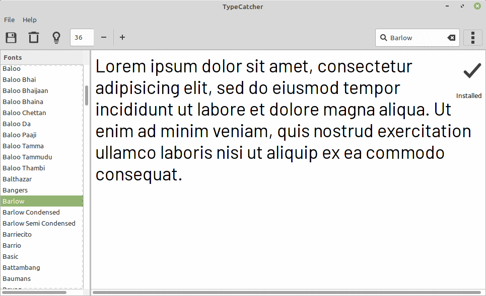

# Installation Tips


## If network connectivity is ever questionable, run a local web server.

Most content types are flexible enough to display remote content.
Having a local server with a local configuration file
will better let the display recover in the event of a network disruption.


## Want fancy fonts?  Install `typecatcher`.



```bash
$ sudo apt-get install typecatcher
```

Typecatcher is an application that makes it easy to install Google Fonts
on your Raspberry Pi or Linux Mint display.

Once installed, the fonts can then be used on your display by setting the
`fontFamily` property in the display's config file.
